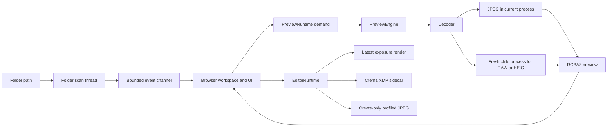

# Crema architecture

## Overview

Crema is currently a native desktop prototype for browsing a folder, previewing
photographs, changing exposure, saving XMP sidecars, and exporting JPEGs. The UI
uses `eframe` with WGPU rendering and AccessKit support. [`Browser`](crates/crema-app/src/browser.rs)
owns the session workspace, textures, edit documents, and visible state.

Crema does not yet have a persistent photo library. There is no SQLite catalog,
import database, recursive folder traversal, file watcher, or rescan workflow.
Each launch scans one folder and assigns process-local asset IDs. The durable data
consists of Crema-owned XMP sidecars, exported JPEGs, and a derived thumbnail cache.

The workspace has three crates:

- [`crema-core`](crates/crema-core/src/lib.rs) owns folder scanning, edit state,
  and sidecar persistence.
- [`crema-image`](crates/crema-image/src/lib.rs) owns format classification,
  decoding, exposure rendering, and JPEG encoding. It depends on `crema-core` for
  edit recipes and sidecar naming.
- [`crema-app`](crates/crema-app/src/lib.rs) owns the desktop UI, background
  scheduling, platform file identity, caching, and export publication. It depends
  on both lower-level crates.

## Key concepts

`AssetCandidate<CandidateFormat>` pairs a path with a process-local `AssetId` and
a format inferred from the filename extension. These IDs coordinate work during
one launch. They are not stable catalog identifiers.

`JobKey` combines an asset, a workspace generation, and either the thumbnail or
viewer purpose. `PreviewRuntime` replaces its complete demand set whenever
selection or visibility changes. `InterestId` and `AttemptId` prevent results
from cancelled or superseded work from reaching the UI.

`SourceStamp` records the identity and observed state of an open file. Preview
caching, sidecar saving, and export use it to detect replacement or modification
while work is in progress.

`EditSession` keeps a durable recipe and a draft recipe. The current `EditRecipe`
contains only exposure, stored in centistops from `-500` to `500`. Every change
creates a `RecipeSnapshot` with a new revision.

## Runtime flow

The [`crema` entry point](crates/crema-app/src/main.rs) has two modes. Normal mode
starts the `eframe` application for a folder. The internal
`--crema-decode-worker` mode reads one bounded decode request from standard input
and returns one bounded response on standard output.

### Folder discovery

[`scan_folder`](crates/crema-core/src/lib.rs) wraps `std::fs::read_dir`. It visits
only direct children, preserves filesystem iteration order, and streams candidates
as they arrive. The scan thread in [`jobs.rs`](crates/crema-app/src/jobs.rs)
publishes events through a bounded channel with capacity 32. A large folder does
not require a complete result list before the grid appears.

[`classify_candidate`](crates/crema-image/src/lib.rs) recognizes common RAW
extensions, JPEG, HEIC, PNG, and TIFF. Recognition does not guarantee decoding.
PNG and TIFF reach the UI as unsupported because no decoder is enabled for them.

### Preview scheduling and decoding

On each UI pass, `Browser` builds demand from the selected asset and the visible
thumbnails. [`PreviewRuntime`](crates/crema-app/src/jobs.rs) runs one decode attempt
at a time and gives the selected asset priority. Replacing demand cancels work
that is no longer relevant. Generation, interest, and attempt guards reject stale
completions.

[`PreviewEngine`](crates/crema-app/src/preview.rs) opens the source file and
captures its `SourceStamp`. It retries once if the source changes during cache
lookup or decode. Thumbnail requests target 320 pixels. Viewer requests target at
most 4096 pixels and can display a cached 320-pixel thumbnail while the larger
decode runs.

The persistent [`ThumbnailCache`](crates/crema-app/src/thumbnail_cache.rs) stores
bounded 320-pixel records under the platform cache directory. Its default budget
is 512 MiB. Cache keys include the source stamp, format, renderer version, and
target size. Crema disables a cache root that resolves inside the source folder.

[`Decoder`](crates/crema-image/src/worker.rs) reads every source through explicit
byte and pixel limits. JPEG decoding stays in the application process. Each RAW or
HEIC decode starts a fresh copy of the current executable in worker mode. The
parent process bounds the protocol, applies a deadline, and kills and reaps a
worker after cancellation or failure.

[`decode.rs`](crates/crema-image/src/decode.rs) uses Rawler's baseline development
for RAW files. That path is experimental and does not establish camera-specific
color quality. HEIC decoding accepts only 8-bit input with no embedded ICC profile
and NCLX values `[1, 13, 6, 0]`. Other HEIC color descriptions fail as unsupported.
JPEG ICC profiles are converted to sRGB when present.

The UI uploads decoded RGBA8 pixels into `egui` textures. A viewer entry retains a
1024-pixel copy for interactive exposure changes and a detail copy capped at 4096
pixels. Crema does not apply the monitor's display profile.

### Editing, saving, and export

Opening a viewer also opens an [`EditSession`](crates/crema-core/src/edit.rs)
through [`SidecarStore`](crates/crema-core/src/sidecar.rs). The editor changes only
the draft exposure recipe. The **Before** view bypasses that recipe without
changing it.

[`EditorRuntime`](crates/crema-app/src/editor.rs) owns three background workers:

- The render worker keeps only the latest request. `RenderKey` includes the asset,
  edit revision, source epoch, and interactive or settled quality. An obsolete
  render cannot replace the current image.
- The save worker consumes a FIFO queue with capacity 8.
- The export worker consumes a FIFO queue with capacity 4.

Dragging the exposure control renders from the retained 1024-pixel preview.
Releasing it renders from the detail preview.
[`render_exposure_srgb8`](crates/crema-image/src/edit_render.rs) applies the recipe
to display-ready 8-bit sRGB pixels. Preview and export share this renderer, but
neither path is scene-linear or full-resolution RAW processing.

`SidecarStore` recognizes only Crema-owned XMP packets. It writes schema 2, and it
can read schema 1 before upgrading it on save. A foreign packet, a newer schema, an
ambiguous sidecar association, or an unsafe target makes saving read-only. Before
publication, the save path checks the previous sidecar contents, the source
association, and the source identity again. It writes through a synced temporary
file and verifies the published bytes.

Export reopens and decodes the source at a maximum edge of 4096 pixels. It applies
the submitted recipe snapshot and writes a quality-92 JPEG with an embedded sRGB
profile through [`jpeg_export.rs`](crates/crema-image/src/jpeg_export.rs). The
destination is `<complete source filename>-crema.jpg`. Publication is create-only,
so Crema refuses to replace an existing export. The source identity must still
match before publication.

Closing the window prompts only when a draft recipe differs from its durable
recipe. During shutdown, Crema cancels preview work, drops any pending render,
lets queued saves and exports finish, and joins the worker threads.

## Repository map

- [`crates/crema-app/src/browser.rs`](crates/crema-app/src/browser.rs) contains the
  main UI state and connects scan, preview, edit, save, and export events.
- [`crates/crema-app/src/jobs.rs`](crates/crema-app/src/jobs.rs) contains folder
  scan delivery and preview scheduling.
- [`crates/crema-app/src/editor.rs`](crates/crema-app/src/editor.rs) contains the
  render, save, and export workers.
- [`crates/crema-app/src/platform.rs`](crates/crema-app/src/platform.rs) defines
  platform cache locations and file identity.
- [`crates/crema-core/src/edit.rs`](crates/crema-core/src/edit.rs) defines recipes,
  revisions, dirty state, and save state.
- [`crates/crema-core/src/sidecar.rs`](crates/crema-core/src/sidecar.rs) defines
  sidecar discovery, parsing, conflict checks, and publication.
- [`crates/crema-image/src/decode.rs`](crates/crema-image/src/decode.rs) contains
  codec-specific decode and color acceptance rules.
- [`crates/crema-image/src/worker.rs`](crates/crema-image/src/worker.rs) contains
  child-process supervision and the wire protocol.
- [`crates/crema-app/src/bin`](crates/crema-app/src/bin) contains scan, decode-probe,
  runtime-benchmark, and UI-fixture tools.

## Current limits

The current design is session-local. Closing Crema discards selection, asset IDs,
decoded viewer state, and edit drafts that were not saved. The thumbnail cache
speeds later browsing, but it is not a photo catalog and cannot reconstruct
application state.

Image processing also remains preview-oriented. RAW uses baseline development,
HEIC support has a narrow color allowlist, exposure starts from 8-bit display-ready
pixels, and output stops at 4096 pixels. Those limits define the implementation
today, not the intended scope of a complete photo manager.
