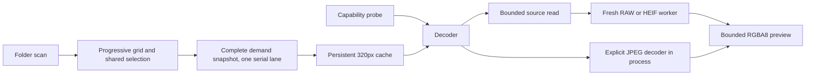

# Decode prototype reference

Crema uses one `crema_image::Decoder` for the GUI and the capability probe.
`CandidateFormat` is an extension hint. The decoder returns a `Decoded`,
`Unsupported`, or `Failed` outcome independently of that hint.



`crema-app` owns asset IDs, generation keys, demand, textures, and selection.
`crema-image` owns codecs, source facts, byte framing, and child supervision.
The worker receives bytes and a private codec tag. It receives no path, asset ID,
selection, or UI generation. Each app executable that uses the decoder dispatches
its own private `--crema-decode-worker` entry before parsing ordinary arguments.

The parent reads at most 256 MiB plus one detection byte from an open source file.
RAW workers use `RawSource::new_from_shared_vec`; HEIF workers use `decode_bytes`.
Default limits are 100 million source pixels, a 4096-pixel preview edge, and a
60-second worker deadline. The response cap follows the requested preview size,
up to 64 MiB of RGBA8. Metadata is limited to 64 KiB and individual strings to
4 KiB. Stderr retains its first 64 KiB and drains the remainder.

These limits do not impose a hard RSS ceiling or create a security sandbox.
RAW and HEIF libraries can allocate before they expose dimensions. The GUI runs
one decode at a time, caps thumbnail textures at 128 MiB, retains two viewer
textures, and bounds pending result messages to two. Shutdown cancels and reaps
the current heavy worker. An in-process JPEG finishes before the coordinator exits.

`PreviewRuntime` receives the selected request and every visible thumbnail request,
including requests whose textures are already cached. Each continuous request has
an `InterestId`. Every execution has a new `AttemptId`. Removing and readding A
creates a different interest, so an old A completion cannot satisfy or remove it.

An uncached selected request preempts lower-priority work. Selecting a cached item
preserves an active still-visible thumbnail. Removed interests still cancel,
including an obsolete viewer. An offscreen grid selection remains in selected demand.
A visible thumbnail keeps
its interest and resumes afterward. `CancelToken` belongs to one attempt, not the
decoder. Reads check cancellation between 64 KiB chunks. RAW and HEIF cancellation
kills and reaps the child before the serial lane starts another request. In-process
JPEG checks cancellation before and after the codec call, not inside the codec.
Cancellation never becomes an unavailable texture-cache entry.

The scheduler owns its shutdown predicate under the demand mutex. Selected and
thumbnail completions have separate one-entry slots. Selected output drains first.
The independent bounded scan channel cannot occupy a decode slot. Admission and
shutdown both recheck the interest and attempt while waiting. Completion and scan
events request repaints. Idle logic does not request a repaint.

## Persistent thumbnail cache

`PreviewEngine` and `ThumbnailCache` are app-owned and contain no egui types. Only
320px RGBA8 thumbnails persist. Viewer output remains in memory. A successful viewer
decode derives its thumbnail from the decoded pixels and stores it without reading
or developing the source again. A viewer cache hit supplies the thumbnail first,
then requests the full 4096px viewer decode. A cold viewer goes directly to that
decode instead of first developing a separate thumbnail.

On macOS the default root is `$HOME/Library/Caches/crema/thumbnails-v1`. Unix uses
the opened source's device, inode, length, mtime, and ctime, including nanoseconds.
The cache key also includes the route, 320px edge, and renderer revision. The engine
checks the opened file and current path again after decode. A changed source gets
one retry. No full source-content hash runs on cache lookup. Deliberately restored
identity and timestamps can still produce a stale hit. Platforms without the
opened-file identity adapter disable persistence and retain normal decode behavior.

The immutable `CRMATHM1` container is independent of the worker protocol. It stores
the complete key, bounded source facts, pixels, and an FNV-1a checksum. Readers cap
the file at 320 × 320 × 4 bytes plus 64 KiB before allocation. Corruption, truncation,
obsolete schema, mismatched keys, and oversized files are misses. Invalid owned
entries are removed on a best-effort basis. Publication uses
a unique same-directory `create_new` temporary file, file sync, and atomic rename.
An existing valid matching entry counts as successful publication without replacement.
A corrupt destination can be removed before the complete temporary file is renamed.
Replacement of corrupt data is not strictly atomic. Interrupted writes leave no
partial final record. Maintenance removes owned
temporary files older than one hour and prunes owned entries by actual byte count.
Foreign files and symlinks are not maintenance targets.

The default budget is 512 MiB. Maintenance follows selected lookup and output,
never precedes them. Concurrent processes can temporarily exceed the budget.
The next completed write reconciles actual bytes. This is an eventual quota, not
a global reservation system. Pruning uses entry publication time, not an access
write on each hit. Disabled or unwritable caches fall back to decode. Cache roots
come from platform cache locations or explicit injection, never source-folder
fallback. The GUI rejects cache roots equal to or inside its opened source folder.
The engine also checks injected roots against each source folder. Existing symlink
aliases resolve before the check, and unsafe or unresolved roots disable persistence.
Cache paths containing parent-directory components are rejected before resolution.
`CREMA_CACHE_ROOT` injects a GUI cache directory. `CREMA_CACHE_DISABLED`
disables persistence. Benchmark and test callers inject their own roots.

The probe reports source dimensions, developed or oriented dimensions, preview
dimensions, route, source precision, decoded storage precision, orientation,
ICC state, NCLX fields, camera identity, limitations, elapsed time, and failure class.
Source precision remains unknown when the codec API exposes only its decoded
sample representation. Ordinary decode reports mark peak RSS as unmeasured.

`scripts/verify-decode.py` runs one probe per supplied file. It hashes originals
before and after, captures stdout and stderr, and records macOS `/usr/bin/time -l`
maximum resident set size separately as `probe_max_rss_bytes`. That process counter
is not a sum of simultaneous parent and worker memory. Other platforms report the
counter as unavailable. Reports stay outside the repository and source folders.

```sh
cargo test -p crema-image
cargo test -p crema-app --lib --test scan_cli --test decode_cli
cargo test -p crema-app --test preview_runtime
cargo clippy --workspace --all-targets -- -D warnings
cargo build --release -p crema-app --bins
python3 scripts/verify-decode.py /tmp/crema-proof /path/to/photo.ORF /path/to/photo.HEIC /path/to/photo.jpg
```

## Browser measurements

`crema-nitro` drives the same `PreviewRuntime` as the GUI in a fresh real process.
It reports runtime readiness and receipt, not rendered frames. The runner accepts
`thumbnail`, `viewer`, `next`, `cancel`, `aba`, and `pressure` scenarios. Cancellation
scenarios require a RAW or HEIF first fixture and wait for its actual worker spawn.
The first fixture determines the cold and warm open measurement. The ordered list
determines the next-photo sequence.
Next-photo scenarios require at least two fixtures and a completed transition.

```sh
cargo build --release -p crema-app --bins
python3 scripts/nitro-browser.py /tmp/crema-browser-baseline --samples 5 --with-cancellation /path/to/photo.ORF /path/to/photo.jpg /path/to/photo.HEIC
python3 scripts/nitro-browser.py /tmp/crema-browser-after --samples 5 --with-cancellation --compare /tmp/crema-browser-baseline /path/to/photo.ORF /path/to/photo.jpg /path/to/photo.HEIC
```

The output directory must be new and outside the repository and source folders.
Each sample gets a fresh cache directory. The next thumbnail run reuses that cache
in a new process. Warm thumbnail acceptance requires a cache hit, zero source-byte
reads, and zero worker starts. Hashes run in separate before and after integrity
phases. Those reads can warm the OS cache, so the report says application-cache
cold and persistent warm, never OS disk-cold. `summary.tsv` includes p50, p95, and
sample count. `host.json` records fixture hashes, platform, commit, and binary hash.
Small sample counts remain small samples, even when a p95 column exists.

`first_usable_received_us` ends at the first selected thumbnail or viewer received.
`target_received_us` ends at the requested output, usually the full viewer.
For `next`, these fields contain only transitions after the first fixture. The first
fixture has separate `initial_first_usable_received_us` and `initial_target_received_us`
fields. Comparisons reject older measurement schemas that pooled initial opens
with next-photo transitions.
`cancel_to_reap_us` spans cancellation request to the actual child's completed wait.
Cache hits, misses, source bytes, worker starts, obsolete drops, and priority drops
have separate counters. `process_wall_us` includes fixture discovery and shutdown.
Demand-to-receipt excludes fixture discovery. macOS `time_l_max_rss_bytes` is the
OS process counter, not a sum of simultaneous parent and worker RSS. Failed runs,
missing macOS RSS counters, and changed originals fail the script.

Actual GUI metrics are opt-in and save on a normal exit. The output file must not
already exist. The same injected cache root can support a cold launch followed by
a warm launch.

```sh
CREMA_CACHE_ROOT=/tmp/crema-gui-cache CREMA_METRICS=/tmp/crema-gui-cold.tsv target/release/crema /path/to/photos
CREMA_CACHE_ROOT=/tmp/crema-gui-cache CREMA_METRICS=/tmp/crema-gui-warm.tsv target/release/crema /path/to/photos
```

`gui_selection`, `gui_received`, `texture_upload_call_us`, and
`first_selected_draw` separate selection, CPU receipt, texture allocation, and
the first actual selected-image draw call. The upload duration covers the egui
allocation call, not GPU completion. A draw call is not a display-present fence.
These timestamps do not claim when the monitor shows the frame. The event buffer
is capped at 100,000 records and reports dropped events. Overflow invalidates a
benchmark sample. No screenshot or private pixel artifact enters the repository.

Tests generate JPEG pixels, embed EXIF and ICC segments, exercise all eight
orientation transforms, reject invalid pixel shapes and protocol frames, and run
real child processes for truncated frames, oversized frames, exit failures,
timeouts, and unbounded stderr. CLI tests verify report continuation, strict exit,
new-worker recovery, and unchanged original bytes. UI state tests verify stable
selection and stale-generation rejection. Runtime tests use real subprocesses for
selected preemption, child reap, continuous thumbnail restart, full-publication
shutdown, and persistent-cache reuse across process restart. Cache tests use real
files for corruption, atomic publication, quota reconciliation, and fallback.

This slice does not establish the full Phase 0 release gate. RAF modes, broad RAW
coverage, progressive JPEG fixtures, HEIC HDR and high-bit-depth variants, color
accuracy, Windows and Linux behavior, full-resolution zoom, XMP, and export need
separate evidence. Private source photographs and their pixels are not repository
fixtures. Rawler keeps its LGPL license independently of Crema's MIT license.
