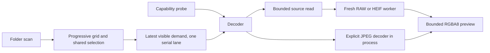

# Decode prototype reference

Crema uses one `crema_image::Decoder` for the GUI and the capability probe.
`CandidateFormat` is an extension hint. The decoder returns a `Decoded`,
`Unsupported`, or `Failed` outcome independently of that hint.



`crema-app` owns asset IDs, generation keys, demand, textures, and selection.
`crema-image` owns codecs, source facts, byte framing, and child supervision.
The worker receives bytes and a private codec tag. It receives no path, asset ID,
selection, or UI generation. Each app executable that uses the decoder dispatches
its own private `--crema-decode-worker` entry before parsing ordinary arguments.

The parent reads at most 256 MiB plus one detection byte from an open source file.
RAW workers use `RawSource::new_from_shared_vec`; HEIF workers use `decode_bytes`.
Default limits are 100 million source pixels, a 4096-pixel preview edge, and a
60-second worker deadline. The response cap follows the requested preview size,
up to 64 MiB of RGBA8. Metadata is limited to 64 KiB and individual strings to
4 KiB. Stderr retains its first 64 KiB and drains the remainder.

These limits do not impose a hard RSS ceiling or create a security sandbox.
RAW and HEIF libraries can allocate before they expose dimensions. The GUI runs
one decode at a time, caps thumbnail textures at 128 MiB, retains two viewer
textures, and bounds pending result messages to two. Shutdown cancels and reaps
the current heavy worker. An in-process JPEG finishes before the coordinator exits.

The grid requests visible thumbnails. Selection and visible demand replace queued
work. A currently running decode finishes before newer work starts. Results from
an older folder generation are discarded. Results for another selected photo can
enter the cache but cannot change selection. Completion and scan events request
repaints. Idle logic does not request a repaint.

The probe reports source dimensions, developed or oriented dimensions, preview
dimensions, route, source precision, decoded storage precision, orientation,
ICC state, NCLX fields, camera identity, limitations, elapsed time, and failure class.
Source precision remains unknown when the codec API exposes only its decoded
sample representation. Ordinary decode reports mark peak RSS as unmeasured.

`scripts/verify-decode.py` runs one probe per supplied file. It hashes originals
before and after, captures stdout and stderr, and records macOS `/usr/bin/time -l`
maximum resident set size separately as `probe_max_rss_bytes`. That process counter
is not a sum of simultaneous parent and worker memory. Other platforms report the
counter as unavailable. Reports stay outside the repository and source folders.

```sh
cargo test -p crema-image
cargo test -p crema-app --lib --test scan_cli --test decode_cli
cargo clippy --workspace --all-targets -- -D warnings
cargo build --release -p crema-app --bins
python3 scripts/verify-decode.py /tmp/crema-proof /path/to/photo.ORF /path/to/photo.HEIC /path/to/photo.jpg
```

Tests generate JPEG pixels, embed EXIF and ICC segments, exercise all eight
orientation transforms, reject invalid pixel shapes and protocol frames, and run
real child processes for truncated frames, oversized frames, exit failures,
timeouts, and unbounded stderr. CLI tests verify report continuation, strict exit,
new-worker recovery, and unchanged original bytes. UI state tests verify stable
selection and stale-generation rejection.

This slice does not establish the full Phase 0 release gate. RAF modes, broad RAW
coverage, progressive JPEG fixtures, HEIC HDR and high-bit-depth variants, color
accuracy, Windows and Linux behavior, full-resolution zoom, XMP, and export need
separate evidence. Private source photographs and their pixels are not repository
fixtures. Rawler keeps its LGPL license independently of Crema's MIT license.
