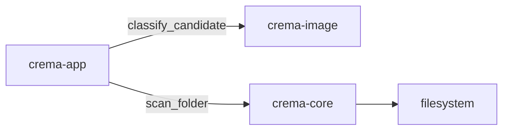

# Why the first folder scan is an iterator

Crema needs to show the first recognized photograph before it has examined a whole folder. A lazy iterator matches that requirement without adding a worker runtime or storing an intermediate list.

## Ownership

`crema-core` owns generic filesystem discovery. `FolderScan<K>` holds one open `ReadDir` and yields one `ScanEvent<K>` at a time. The generic candidate kind keeps the crate independent of image formats.

`crema-image` owns `CandidateFormat`, `RawFormat`, `RasterFormat`, and filename classification. Classification is case-insensitive and based only on the final extension. A classified file is a candidate for later decoding. Classification does not claim that its bytes are valid or supported by a decoder.

`crema-app` supplies `classify_candidate` to `scan_folder`. It also owns argument
validation, output, and process exit status. This composition keeps image-format
and codec policy out of generic filesystem discovery.

The design comparison favored this sibling-crate shape over a `crema-core` dependency on `crema-image`. The function pointer is the only policy input. It keeps format knowledge out of filesystem discovery without adding a trait or callback framework.

## Data and failure shapes

`AssetCandidate<K>` stores a private `AssetId`, path, and kind. Callers can read these values through accessors but cannot construct a candidate with a missing identity. `AssetId` is an opaque nonzero token. The allocator gives each candidate a distinct ID during the current process. The ID does not survive a restart or rescan.

`ScanEvent<K>` separates candidates from recoverable entry failures. A `ReadDirectoryEntry` failure has the root path because the operating system did not provide a reliable entry path. An `InspectCandidate` failure has the candidate path. The iterator returns either failure and resumes with the next directory entry.

`FolderOpenError` is separate because a root-open failure prevents iteration. Its kind distinguishes a missing path, a non-directory path, denied permission, and other I/O failures. The CLI returns a failure status for both root-open failures and any entry failures.

## Deliberate limits

The scanner does not recurse or sort. Filesystem order lets callers receive candidates without waiting for a complete pass. A later UI can sort its own visible snapshot.

The scanner classifies a path before it reads metadata. It then follows symbolic links with `std::fs::metadata` and accepts only destinations that are regular files. Dangling recognized links become entry failures. Unrecognized entries and non-files remain silent.

The classifier is a function pointer. This keeps the interface small and meets the current composition need. A callable that captures configuration can replace it when a real caller needs configuration.

Recursion policy and persistent file identity remain open. Both depend on later product rules for folder navigation, watched roots, moves, and relinking. This slice does not guess those rules.

## Alternatives rejected

A scanner that returns a sorted `Vec` would delay every result until the folder scan finishes. A scanner that starts its own worker would force queue, cancellation, and lifetime policy into the core before the desktop runtime exists.

The scanner does not emit an event for every unsupported file or directory. That stream would add work for a fact the current consumer ignores. Add a typed skipped state when the UI has a concrete reason to display it.
