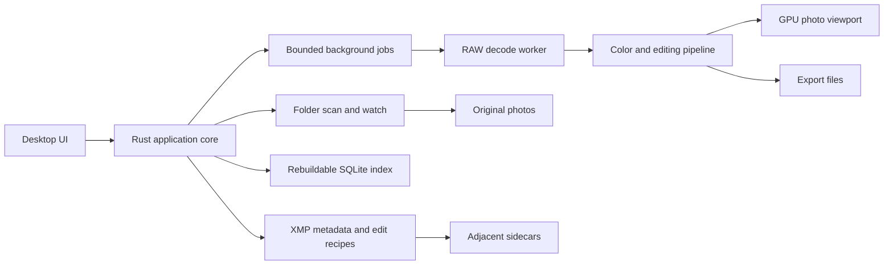
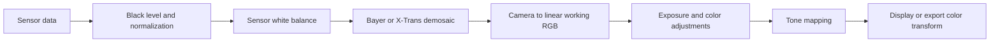

# Crema: initial product and technology plan

Proposal researched and reviewed September 6, 2026. No implementation or dependencies installed.

**Product:** a fast, thoughtfully designed RAW photo manager and non-destructive
editor that works directly with existing folders. macOS, Windows, and Linux are
first-release targets. Rust is required for the application and its processing
dependencies, with SQLite explicitly allowed as an exception.

Broad RAW, HEIC, and JPEG support is a core product requirement. Dan uses Fujifilm
and OM cameras, making RAF and OM System/Olympus ORF the first validation priorities.
Crema's original code uses MIT; this is intended as a noncommercial project.

Crema's workspace combines a folder sidebar, thumbnail grid, large photo viewer,
filmstrip, and contextual editing/metadata inspector. XMP sidecars keep descriptive
metadata and non-destructive editing instructions beside each photograph.

## Product contract

- Opening a folder presents the first available results progressively; indexing
  continues in the background without blocking navigation.
- Originals remain untouched. Ratings, keywords, and edits travel with sidecars.
- A local index accelerates browsing and filtering but can be rebuilt from files.
- Browsing, culling, and editing share selection and navigation state.
- User-visible saved status means the sidecar write succeeded, not merely that an
  in-memory value changed.
- Unsupported formats, disconnected drives, and read-only folders have clear states.

Use standard XMP properties for shared metadata and a documented Crema namespace
for application-specific state. Preserve foreign data. Metadata interchange and
reproducing another editor's processing are separate capabilities; only the former
is initially in scope. [XMP specification](https://developer.adobe.com/xmp/docs/xmp-specifications/).

## Proposed technology choices

SQLite is confirmed; the other choices are recommendations for review. Pin releases
and audit the actual transitive dependencies and enabled features when scaffolding.

| Concern | Recommendation | Reason and constraint |
| --- | --- | --- |
| Desktop UI | `egui` + `eframe`, with the wgpu backend and AccessKit enabled | Rust UI across all three desktops, custom image drawing, and an existing accessibility integration. Budget for deliberate styling and desktop conventions. |
| GPU rendering | `wgpu`; small WGSL shaders where needed | One graphics abstraction over Metal, Direct3D 12, and Vulkan. Use a dedicated photo viewport sharing the UI's GPU device. |
| RAW decoding | `rawler`, behind a small adapter | A Rust candidate with RAF, ORF, and broad camera-format coverage. Validate Bayer and X-Trans development, actual camera modes, and image quality. Its API is unstable and its LGPL dependency obligations remain separate from Crema's MIT license. |
| RAW development | Crema's Rust pipeline, evaluated separately from decoding | Choose and validate demosaicing, camera calibration, and tone rendering. Rawler's convenience development path is a baseline for comparison, not an established production-quality engine. |
| HEIC input | Evaluate `heif-oxide` + `rust_h265` | Both declare MIT/Apache-2.0 options and Rust implementations. Young candidates with documented format, color, and performance limitations; not yet approved for adoption. HEIC support is required, so close the gaps or find a suitable alternative before release. |
| JPEG, PNG, TIFF | `image`, with explicit codec features | Rust codecs for the initial raster formats and exports. Avoid enabling all formats by default. |
| Color transforms | `moxcms`, behind a color module | Rust ICC processing. Test the exact input, display, and output profiles; this does not supply camera characterization or discover monitor profiles for us. |
| Persistent index | SQLite through `rusqlite`, bundled SQLite | Confirmed exception to pure Rust dependencies. SQL, transactions, and indexes fit folder, capture-time, rating, and keyword queries. Bundle a pinned version for consistent builds. |
| XMP | `quick-xml` plus a narrowly scoped Crema XMP module | Rust XML reader/writer. Implement namespace-aware metadata updates and preserve foreign properties. XML parsing alone is not XMP support. |
| EXIF | Rawler metadata plus `nom-exif` where needed | Rust metadata extraction for RAW and ordinary image formats. Expose supported fields honestly rather than promise ExifTool parity. |
| Background work | Bounded job queues and `rayon` | CPU work stays off the UI thread. Prioritize the selected photo and visible thumbnails; limit concurrent decoding by memory budget. |
| Folder changes | `notify` plus reconciliation scans | Watch events trigger refreshes, while scans recover from missed events and reconnects. |
| State and diagnostics | `serde`/`serde_json`, `tracing` | Versioned recipes and settings, structured timing and error reports. |

Primary references: [egui](https://github.com/emilk/egui),
[wgpu](https://wgpu.rs/), [Rawler](https://github.com/dnglab/dnglab),
[image](https://github.com/image-rs/image),
[heif-oxide](https://docs.rs/crate/heif-oxide/0.1.0),
[rust_h265](https://docs.rs/crate/rust_h265/0.1.0),
[moxcms](https://github.com/awxkee/moxcms),
[rusqlite](https://github.com/rusqlite/rusqlite),
[quick-xml](https://github.com/tafia/quick-xml),
[nom-exif](https://github.com/mindeng/nom-exif),
[Rayon](https://docs.rs/rayon/latest/rayon/),
[notify](https://docs.rs/notify/latest/notify/).

**Rust boundary:** application logic, UI implementation, codecs, and color processing
should be Rust. SQLite is an approved C dependency. Window systems, filesystem
services, accessibility APIs, and GPU drivers necessarily use platform interfaces. GPU shader code would
be WGSL, with Rust CPU implementations as the correctness reference. This proposal
does not substitute C/C++ processing libraries behind Rust wrappers. If the Rust
requirement also excludes shader languages, keep processing on the CPU initially.

**Why egui:** it fits an interactive photo workspace and exposes the graphics
integration we need. Its default visual style is not the intended Crema design;
native-looking widgets are explicitly not an egui goal. Prove keyboard navigation,
text editing, accessibility, menus, and polished layouts before committing to it.
This is an engineering judgment, not a claim that it is universally the fastest UI.

**Other UI options:** [Iced](https://github.com/iced-rs/iced) is the strongest
alternative to prototype if egui's layout or interaction model proves limiting;
upstream still labels it experimental. [GPUI](https://gpui.rs/) is interesting for
a custom desktop application, but its documentation notes its close coupling to
Zed. Avoid adding that integration risk to a new RAW pipeline. SwiftUI does not
meet the platform requirement. A webview UI does not meet the selected Rust UI
direction.

## Format support is a release gate

Prioritize Fujifilm and OM System/Olympus without limiting the product to those
brands. Exact models and recording modes remain to be established.

| Coverage | Initial acceptance requirements |
| --- | --- |
| Fujifilm RAF | Bayer and X-Trans sensor layouts as applicable; uncompressed, lossless-compressed, and lossy modes where available. Validate fine detail, false color, white balance, and camera matrices. Do not equate RAF decoding with X-Trans development quality or reproduction of Fuji film simulations. |
| OM System/Olympus ORF | Ordinary RAW captures first; separately validate high-resolution modes, active sensor area, orientation, white balance, highlight behavior, and camera color. |
| Broad RAW | Representative Canon CR2/CR3, Nikon NEF, Sony ARW, Panasonic RW2, Pentax PEF, and DNG fixtures, with a published model/mode matrix. Expand from the decoder's camera database, verifying decoded pixels and developed results separately. |
| HEIC | Real phone and camera files, 8/10-bit precision, grid images, rotation/mirroring, EXIF, ICC/CICP color information, and correct SDR presentation of supported HDR inputs. Reading, previewing, editing, and exporting to JPEG/TIFF are initial scope; HEIC encoding is not required for the MVP. |
| JPEG | Baseline/progressive files, EXIF orientation, embedded profiles, metadata and sidecars, editing, and export. Keep RAW+JPEG companion edits distinct. |

Rawler's [camera list](https://github.com/dnglab/dnglab/blob/main/SUPPORTED_CAMERAS.md)
is an input to the test matrix, not a claim that Crema already supports each entry.
PNG and TIFF remain useful additional inputs. A filename extension alone does not
establish support for every camera, compression mode, or computational variant.

Source review found Rawler's current convenience development path selects bilinear
X-Trans demosaicing and can fall back to an identity color matrix when calibration
is absent. Use that path only as a baseline. Phase 0 must evaluate X-Trans fine-detail
quality and a suitable Rust demosaicing implementation, and distinguish missing
camera calibration from supported color rendering. Recheck the pinned release;
these observations concern the upstream source reviewed on the date above.
[Rawler development source](https://github.com/dnglab/dnglab/blob/main/rawler/src/imgop/develop.rs).

Evaluate [heif-oxide 0.1.0](https://docs.rs/crate/heif-oxide/0.1.0) first for license
fit, then correctness and speed. Upstream reports 44/63 conformance files decoding,
with embedded ICC application and PQ/HLG tone mapping absent. Its sRGB-oriented
output needs examination before connecting it to Crema's working-color pipeline;
preserve source precision and avoid premature gamut reduction or duplicate transforms.
The underlying [rust_h265](https://docs.rs/crate/rust_h265/0.1.0) also declares
MIT/Apache-2.0 licensing. Neither candidate has been built or tested here.

HEIC is part of the release gate, not an optional future feature. A prototype may
show unsupported variants clearly while work continues, but that state does not
fulfill broad HEIC support. If evaluation fails, address the upstream gaps or
reassess candidates explicitly; do not silently introduce a native codec dependency.

Rawler's upstream documentation describes alpha maturity, unstable APIs, and
limitations around malformed input; its manifest declares LGPL-2.1. Make both
technical validation and license fit explicit adoption gates.
[Upstream README](https://github.com/dnglab/dnglab/blob/main/README.md),
[manifest](https://github.com/dnglab/dnglab/blob/main/rawler/Cargo.toml).

Run RAW decoding in a restartable worker process with bounded inputs, output sizes,
and time limits. This contains failures but is not a substitute for a security
sandbox or well-behaved decoders. Report a per-file error instead of losing the UI.

## Project and dependency licensing

The repository's [LICENSE](../LICENSE) applies MIT to Crema's original work. MIT
permits commercial reuse; noncommercial describes Dan's intent, not an added use
restriction. [MIT license text](https://opensource.org/license/mit).

Dependencies keep their own licenses. Rawler is LGPL-2.1, so distributing it requires
an appropriate source/notices and linking/relinking compliance plan; putting MIT
on Crema does not relicense Rawler. Keep the decoder boundary technically clean,
but do not assume that a worker process removes licensing obligations.
[Rawler license](https://github.com/dnglab/dnglab/blob/main/LICENSE).

Prefer permissively licensed HEIC candidates. The previously considered
[Imazen heic](https://github.com/imazen/heic) offers AGPL/commercial licensing and is
not the default for this MIT-oriented project. Noncommercial use alone does not
waive dependency terms. Final binary packaging needs an audit of pinned dependency
versions and any modifications; no codec has been installed by this planning work.

## Design direction

Make the photograph the visual focus. Use neutral charcoal around the image,
consistent spacing, readable text, restrained separators, and one selection accent.
Support a light interface as well; retain a neutral photo surround.

| Workspace | Layout and primary job |
| --- | --- |
| Browse | Folder tree left, virtualized grid center, optional metadata inspector right. Search and filter controls remain in one stable location. |
| Review | Large image, optional filmstrip, ratings and pick/reject shortcuts. Fit and 100% zoom, keyboard navigation, and later synchronized comparison. |
| Edit | Same viewer and selection, right inspector organized as Light, Color, Detail, and Geometry. Histogram above controls; before/after and undo remain easy to reach. |

Use labeled actions for common tasks, tooltips for compact controls, clear focus
rings, adjustable thumbnail sizes, and accessible names. Keep EXIF details behind
progressive disclosure. Group related actions in stable, labeled controls.

Show an embedded camera preview quickly, then develop the RAW when needed. Label
that transition: the camera's JPEG and Crema's default development can legitimately
look different. Existing edits must replace the embedded preview with an edited
thumbnail; do not present the camera preview as the edited result.

Design the empty-folder, loading, permission-error, disconnected-drive, and
sidecar-conflict states alongside the happy path. Selection and scroll position
must survive switching views and background index updates.

## Architecture and ownership

Start with three Cargo workspace crates: `crema-app` for UI/platform adapters,
`crema-core` for assets/metadata/storage/jobs, and `crema-image` for decoding/color/
rendering/export. The app package can also provide the decoder-worker executable.
Keep modules internal until there is a concrete reason to split another crate.

Keep crate dependencies acyclic: the app depends on core and image, while image
has no dependency on UI or catalog state. Core owns asset/recipe persistence; the
app coordinates jobs against image's processing interface. Do not serialize an
entire floating-point image as JSON between worker and UI. Use bounded binary
messages and measured buffer transfer, and share a global concurrency/memory budget
across worker processes and Rayon pools.

The UI sends commands and reads state snapshots. Persistent writes and decoding
never happen during widget layout. Asset IDs identify selections independently of
current paths. Use platform file identity where available, and verify identity
before relinking after moves; do not hash every large RAW before showing a folder.

Keep the database and thumbnail cache in local application storage, outside photo
folders and shared drives. Settings and any recovery journal are separate durable
application state. There are no authoritative edits hidden solely in the index.

Use SQLite WAL mode, short transactions, a serialized background writer, and
separate reader connections. Start with tables for roots, assets, sidecar state,
keywords, and asset-keyword relationships. Add indexes for actual filter/sort paths
and versioned migrations. Keep thumbnail bytes in the cache directory; store their
keys and state in the database. Add full-text search only when the search UX needs
it. The live database stays on local storage even when originals are on an external
or network drive. SQLite documents this desktop use case and WAL's local-host
constraints. [SQLite use cases](https://www.sqlite.org/whentouse.html),
[WAL documentation](https://www.sqlite.org/wal.html).

Sidecar and database writes are separate transactions. Commit the sidecar first,
then refresh the index; reconcile after a crash between those steps. Track a recipe
revision so a completed older write cannot mark newer edits as saved. Keep pending
draft recovery outside the rebuildable index and distinguish recovered drafts from
edits confirmed saved beside the original. Removing a folder from the app only
removes its registration; source deletion remains a separate explicit operation.

## Sidecar rules

- Map stars to `xmp:Rating` (0 through 5), rejection to `xmp:Rating=-1`, and keywords
  to `dc:subject`. Store picks and Crema's versioned recipe in its own namespace.
  A rejected photo may retain its previous stars privately, but shared XMP exposes
  rejection until it is cleared. Preserve unfamiliar valid rating values when
  unrelated properties change. [XMP rating](https://developer.adobe.com/xmp/docs/xmp-namespaces/xmp/),
  [keywords](https://developer.adobe.com/xmp/docs/xmp-namespaces/dc/).
- A supported sidecar property takes precedence over embedded metadata, including
  explicit empty keyword lists and unrated values. Represent intentional clearing
  of inherited values; removing a keyword must not resurrect it on the next scan.
- Preserve foreign namespaces, properties, arrays, and qualifiers. Implement XMP
  as namespace-aware RDF/XML updates, not a deserialize/serialize of only known
  fields. Preserve the original packet and refuse writes when parsing is unsafe.
  Bound packet size, nesting, and allocations; disallow DTDs and external entities.
- For new sidecars, use `DSCF0001.xmp` for a proprietary RAW such as
  `DSCF0001.RAF`; append `.xmp` to the full original filename for JPEG, HEIC, DNG,
  PNG, and TIFF, for example `DSCF0001.JPG.xmp`. This keeps RAW and rendered
  companions separate. Preserve filename case and use a lowercase `.xmp` suffix.
  This is Crema's naming policy, not a naming rule imposed by XMP.
- Discover supported existing naming variants without automatic renaming. If
  multiple candidates exist, or a stem-only sidecar could belong to multiple RAWs,
  require explicit association before writing. Record the association and recheck
  it when folder contents change. Do not guess ownership from a basename alone.
- Save through a temporary file in the same directory, flush, then use the
  platform's atomic replacement behavior. Test replacement and durability on each
  supported OS. Re-read the sidecar before committing; preserve an external-change
  conflict instead of silently choosing the last writer. Ordinary file replacement
  does not provide a universal cross-application compare-and-swap guarantee.
- Read-only folders remain browsable. An unsaved edit must stay visibly unsaved,
  with recovery options. Unknown newer recipe versions must not be overwritten.
- RAW+JPEG grouping is a browsing convenience. Each file retains separate edits;
  metadata propagation to the companion must be explicit.

Test metadata exchange against real third-party packets. Preserve foreign edit
recipes as opaque data and state clearly that sidecar discovery conventions differ
between applications.

## Image development and performance

RAW decoding is not a finished editor. Build a defined processing pipeline:

Use floating-point, scene-linear working data, initially linear Rec.2020 RGB.
Keep values above display white until tone mapping. Raster inputs follow their
embedded profile into the working space and bypass sensor processing; linearizing
a JPEG does not recover the original scene information. The default SDR raster
recipe must preserve its existing appearance rather than apply the RAW tone curve
again. HDR HEIC needs input-specific transfer/gain-map handling and a defined SDR
rendering policy. Label untagged SDR inputs assumed sRGB, and never silently treat
HDR samples as sRGB. Geometry and detail stages must have documented ordering when
added. Highlight reconstruction, if introduced,
needs its own sensor-stage treatment rather than a generic brightness slider.
This follows the input/working/output separation described in
[darktable's color documentation](https://docs.darktable.org/usermanual/4.0/en/special-topics/color-management/color-spaces/)
and [pipeline ordering](https://docs.darktable.org/usermanual/4.6/en/darkroom/pixelpipe/the-pixelpipe-and-module-order/).

Maintain a Rust CPU reference path and port measured hot operations to GPU shaders.
Preview and export use the same recipe, stage definitions, and color transforms.
Reduced-resolution preview quality can differ; the full-resolution preview and
export should agree within declared numerical tolerances.

Recipe versions cover algorithm defaults as well as slider values. Save camera
calibration/profile identifiers and stable crop coordinates relative to the oriented
active image. An engine upgrade must migrate explicitly or retain the older render
path; a renderer version in a cache key alone cannot preserve saved appearance.

Export from an immutable recipe snapshot. Normalize orientation, embed the selected
output profile, and deliberately copy supported descriptive metadata. Provide an
explicit location-metadata option. Write to a temporary destination and publish
only after encoding succeeds; do not overwrite an existing file without a chosen
collision policy. Export must never replace an original or its sidecar.

Color management is an early milestone, including monitor-profile discovery,
moving windows between displays, embedded export profiles, and avoiding duplicate
OS/compositor color conversion. A GPU texture does not automatically display correct
colors. Start with SDR output; defer HDR display/output and soft proofing.

Validate the chosen window surface and compositor color behavior on each OS,
including Linux Wayland and X11. Use an explicit sRGB output fallback with a clear
limitation when monitor-profile integration is unavailable; wide-gamut correctness
is not implied by wgpu or by successfully parsing an ICC profile.

Cache embedded thumbnails, edited thumbnails, and resolution-appropriate previews
separately. Cache keys include source identity/change fingerprint, recipe, renderer
version, output size, and relevant color profile. Cancel stale jobs and discard
results from old selection/edit generations. Virtualize the grid and filmstrip.
Use tiled processing for images larger than GPU limits, with overlap for filters.
GPU tiling does not bound the RAW decoder's whole-image allocations. Measure peak
decode memory separately, limit simultaneous large images, and test GPU device loss
and the Rust CPU processing fallback.

Provisional targets, to validate on declared hardware and fixtures:

| Measurement | Initial target |
| --- | --- |
| Cached grid scrolling | 60 fps with 10,000 indexed photos |
| Cached next-photo preview | p95 below 100 ms |
| Exposure drag on a prepared 2 MP preview | p95 response below 50 ms |
| Memory | Explicit CPU/GPU/cache budgets; bounded growth while browsing 100,000 assets |
| Idle behavior | No continuous repainting or full-folder rescans |

Measure cold scans, warm browsing, decoding, GPU upload, and export separately.
Record hardware, file sizes, and p50/p95 latency. Rust alone does not guarantee
responsiveness; scheduling, memory limits, caching, and image copies dominate it.

## Milestones and acceptance gates

| Phase | Deliverable | Gate before expanding |
| --- | --- | --- |
| 0. Feasibility | Polished grid/viewer prototype with RAF, ORF, HEIC, and JPEG paths on macOS, Windows, and Linux | Representative Fuji and OM files develop correctly, including X-Trans where applicable; HEIC precision/color and decoder feasibility are measured. Exposure preview, XMP save/reopen, and profiled JPEG export work. Validate dependency features/licenses, display color, keyboard/assistive access, and memory behavior. |
| 1. Useful browser | Add folders, background scan, fast grid, viewer, filmstrip, EXIF, sort/filter, RAW+JPEG grouping | 10,000-file browsing stays responsive; external renames, missing files, and read-only folders behave correctly. |
| 2. Durable organization | Ratings, picks/rejects, keywords, batch metadata edits, XMP synchronization | Rebuild the index and recover metadata; preserve foreign sidecars; interrupted writes and external changes never silently lose edits. |
| 3. Editing MVP | White balance, exposure, contrast/tone controls, saturation, crop/straighten, basic sharpening, undo/redo, reset, before/after, copy/paste edits; JPEG and 16-bit TIFF export | Golden images and CPU/GPU comparisons pass; restart preserves the recipe; full-resolution preview and export agree. |
| 4. Release hardening | Installable builds on all three OSes, recovery, export queue, accessibility, broad RAW/HEIC/JPEG support matrix | Representative files across the listed RAW brands and required HEIC/JPEG variants pass; publish remaining model/mode exceptions. Real-machine GPU/display tests, permission errors, large-library benchmarks, license packaging, and fresh installation smoke tests pass. |

Split Phase 0 into two bounded proofs: UI navigation/virtualization/accessibility,
and codecs/color/sidecar round trips. Connect them once both are viable. The visual
proof should establish a credible design without building every editor control.
Track the broad format matrix from this phase onward, not only during final QA.

Phase 0 deliberately touches the entire path before building a large DAM. If RAW
quality or pure Rust format coverage is insufficient, that should be discovered
before months of interface work. Define the schedule after these measurements;
a usable browser is much smaller work than a polished general-purpose RAW engine.

After the MVP: comparison/culling tools, saved searches, safe rename/move/trash
operations, presets, lens corrections, denoising, and local masks. File operations
must coordinate originals and sidecars with a recoverable journal; moving several
files is not one atomic operation. Delay AI editing, cloud sync, face recognition,
maps, panorama/HDR merging, video, plugins, and mobile apps.

## Verification strategy

Use unit tests for pure recipe, math, sorting, and XMP transformations, and end-to-end
tests with real files, processes, storage, and the actual application. Do not invent
mock decoder/filesystem behavior.

- Keep a small redistributable fixture corpus, with permission, provenance, expected
  metadata, camera modes, and color-profile information. Personal photos need not
  become public repository assets.
- Include Fuji Bayer/X-Trans, OM ordinary/high-resolution captures, other RAW brands,
  and HEIC/JPEG variants in that corpus. Test decode, metadata, developed color,
  preview, and export separately so thumbnail success cannot mask a broken editor.
- Check default JPEG/SDR HEIC appearance, HDR-to-SDR conversion, missing camera
  profiles, recipe upgrades, tile boundaries, and orientation/crop consistency.
- Test foreign XMP round trips, RAW+JPEG naming, Unicode/case-sensitive paths,
  malformed packets, unsupported recipe versions, and concurrent external changes.
- Test rejected ratings, cleared inherited keywords, database/sidecar crash ordering,
  stale save completions, export collisions/cancellation, and metadata selection.
- Verify original hashes before/after edits. Exercise actual process termination
  during writes, restart recovery, and database/cache rebuilds.
- Use analytic color/maths unit tests, approved golden renders, and perceptual plus
  numeric tolerances. Do not demand bit-identical GPU output across vendors.
- Build and run relevant tests on all three OSes from the first scaffold. Exercise
  Linux Wayland and X11, Windows scaling, and macOS Retina behavior on real machines.
  Headless CI alone is insufficient for color, GPU, and accessibility acceptance.
- During development, run tests added or modified for the change; CI should enforce
  the full relevant platform suites. Capture benchmarks in release builds.

## Decisions needed before implementation

The platform scope, pure Rust processing direction, SQLite exception, broad
RAW/HEIC/JPEG requirement, Fuji/OM priorities, and MIT project license are confirmed.
Remaining inputs are exact camera models/modes, representative files, and baseline
hardware/OS versions. Dependency selection and distribution compliance still need
validation; neither depends on changing Crema's chosen project license.

Recommended next work: settle the remaining proposed dependencies, then scaffold Phase 0.
Its success criterion is concrete: open a mixed folder, develop RAF and ORF files,
render HEIC/JPEG correctly, change exposure, save a sidecar, restart, recover the
edit, and export the same result on all three desktop platforms.
