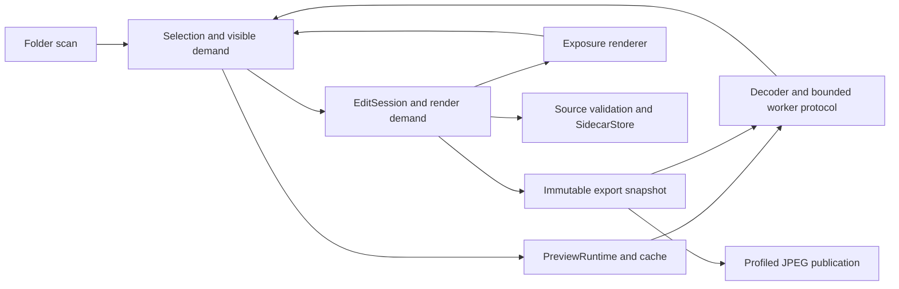

# Phase 0 code review, September 8, 2026

Phase 0 is **not complete** against [the initial plan](../initial-plan.md#milestones-and-acceptance-gates). The Mac JPEG workflow works, but camera development, color, accessibility, memory, and native platform acceptance remain open. Windows save and export are unimplemented. The existing [status](../phase0-status.md) correctly keeps the gate open, despite the latest commit's completion wording.

Reviewed commit `5d4f178b14538ec0f57464d969b863a9c03a0511` from a clean worktree. This review adds documentation and reproduction material only. It changes no application behavior or dependencies. The [handoff](../phase0-handoff.md) orders the fixes and defines completion evidence.

## Findings

P1 findings block required behavior or risk saved edits. P2 findings affect rendering correctness or acceptance reliability. The list excludes style preferences and documented later-phase features.

| ID | Priority | Finding | Evidence |
| --- | --- | --- | --- |
| F1 | P1 | Different RAW originals with the same stem silently share saved edits. | Real-filesystem reproduction against current core source. |
| F2 | P1 | Windows cannot save XMP or export JPEG. | Unconditional non-Unix branches and disabled controls. No native Windows run. |
| F3 | P2 | HEIC accepts unsupported primaries and matrix coefficients. | Actual decoder accepted three unsupported NCLX descriptions. |
| F4 | P2 | A pending exposure render displays the original instead of the last edited image. | Actual egui meshes from the production viewer and scheduler in a temporary test copy. |
| F5 | P2 | A source-only receipt passes a platform GUI gate. | Actual release assessor with filesystem receipt inputs. |
| F6 | P2 | Performance receipts can choose their own passing threshold. | A 999,999 µs p95 passed with a 1,000,000 µs budget. |
| F7 | P2 | The prescribed restart workflow reuses one create-only metrics path. | Producer, metrics writer, and assessor trace. Two live Mac sessions required manual log preservation. |
| F8 | P2 | Python verifier tests do not run in CI or the local Phase 0 command. | Both workflows invoke only Cargo tests. Independent discovery ran 11 Python tests. |

### F1. Block ambiguous RAW sidecar ownership

[SidecarLocation::for_original](../../crates/crema-core/src/sidecar.rs), lines 39–45, maps both `photo.RAF` and `photo.ORF` to `photo.xmp`. [open_document](../../crates/crema-app/src/browser.rs), lines 271–281, opens that packet without identifying competing originals. The owned packet contains no source association.

The reproduction saved RAF exposure at +1.00 EV. Opening ORF then inherited +1.00 EV. Saving ORF at -2.00 EV made RAF reopen at -2.00 EV. Original bytes stayed unchanged, but the earlier saved recipe was silently replaced. This violates the initial plan's explicit sidecar ambiguity rule.

Resolve association before opening an editable session. Represent ambiguity explicitly and require association before writing. Recheck ownership when publishing so a competing RAW introduced after open cannot bypass the check. Preserve the existing distinct RAW and JPEG companion policy.

### F2. Implement Windows identity and publication together

[SourceStamp::read](../../crates/crema-app/src/platform.rs), lines 42–49, always returns `Unsupported` outside Unix. [Browser](../../crates/crema-app/src/browser.rs), lines 787–829, requires source identity for Save XMP and Export JPEG. [commit_sidecar](../../crates/crema-core/src/sidecar.rs), lines 276–283, independently refuses non-Unix publication.

Windows users can adjust exposure but cannot complete save or export. Persistent thumbnail reuse also depends on the missing identity adapter. Four relevant [editor runtime tests](../../crates/crema-app/tests/editor_runtime.rs), at lines 144, 205, 269, and 338, are Unix-only. A green Windows Cargo job would therefore not prove these behaviors.

Implement opened-file identity and durable publication with Windows semantics. Retain source replacement detection, collision refusal, and original protection. Run behavior tests on Windows instead of compiling around them. Rust documents different platform implementations of [rename](https://doc.rust-lang.org/std/fs/fn.rename.html), so Unix success does not establish Windows durability.

### F3. Validate the entire HEIC color description

[validate_heif_color](../../crates/crema-image/src/decode.rs), lines 224–232, discards primaries and matrix coefficients. It accepts transfer codes 1 and 13 regardless of those fields. The pinned `heif-oxide 0.1.0` source in `src/color.rs` defaults unknown matrices to BT.709 and omits a primaries transform outside its supported cases.

An actual small HEIC fixture, changed only in its NCLX tags, decoded successfully with `11,13,6,0`, `1,13,8,0`, and `65535,13,65535,0`. These describe unsupported primaries, an unsupported matrix, and undefined color fields. Display and export can therefore use substituted color despite the stated fail-closed policy.

Accept only complete color descriptions whose conversion has been verified, or implement the missing transforms. Keep high-bit, ICC, and transfer rejection intact until their conversions are established. A decode success is not a color reference.

### F4. Keep the last accepted edit visible while rendering

[schedule_render](../../crates/crema-app/src/browser.rs), line 578, immediately replaces the pending demand. The viewer at lines 1265–1273 excludes the existing edited texture unless it matches that new demand. Lines 1296–1300 then fall back to the original texture.

The reproduction exercised production `viewer()` and `schedule_render()` in a temporary source copy. Actual tessellated egui meshes contained the edited texture before the change and the original texture while the next result was pending. This is an unintended Before frame during editing. Its visible duration depends on render latency.

Separate the last accepted display image from the latest requested render. Keep strict source and revision checks on incoming results. Do not retain an image from another asset or an obsolete source epoch.

### F5. Validate GUI receipt contents before passing a platform

[release_assessment](../../scripts/verify-phase0.py), lines 173–183, accepts a dictionary containing only the matching `source` object. It then reports `darwin-gui Pass` without requiring the receipt schema, successful workflow capabilities, observations, metrics, sidecars, or exports.

Validate one versioned receipt contract and its linked artifacts. Require successful navigation, exposure, save/reopen, export, and close evidence from the declared platform. Bind the app, source, inputs, outputs, and sessions. Native assistive technology and display color remain separate capabilities.

### F6. Own performance thresholds in the assessor

[performance_receipt_error](../../scripts/verify-phase0.py), lines 118–126, accepts any positive `budget_us` and compares p95 against that supplied value. The Mac producer uses 16,667 µs, but the assessor accepted 999,999 µs against a one-second budget.

The assessor must own the threshold and the measurement definition. Validate raw metric provenance, cache state, sample count, traversal, platform, and source identity. GUI CPU work must remain distinct from monitor presentation timing.

F5 and F6 produce false individual gate passes. The overall release assessment still returns blocked because other gates remain open. Neither reproduction demonstrates an overall false Phase 0 pass today.

### F7. Preserve separate save and restart sessions

[prepare](../../scripts/macos-phase0-app.py), line 113, embeds one `gui-metrics.tsv` path for every launch. [Metrics::write](../../crates/crema-app/src/metrics.rs), lines 70–73, creates that file exclusively. The second normal exit cannot publish there while the first log exists.

[finish](../../scripts/macos-phase0-app.py), lines 171–184, uses the first run's `save_finished` event to corroborate a `save-reopen` observation. It does not establish a second process or the restored recipe. The live review manually preserved `gui-metrics-session1.tsv` and `gui-metrics-session2.tsv`, and captured the restored +1.40 EV control. That workaround is evidence from this review, not a repaired workflow.

Assign a unique log and session identity to each launch. Require a clean second session that opens the same original and reports the recipe restored from the saved sidecar. Keep create-only writes.

### F8. Run the tests that protect evidence acceptance

[CI](../../.github/workflows/ci.yml), lines 24–27, and [the local assessor](../../scripts/verify-phase0.py), lines 350–355, invoke Cargo tests alone. The Python tests for receipt validation and benchmark accounting do not run there.

Add Python test discovery to every native CI job and to a required local evidence row. Configure Python explicitly on native runners. The current 11 tests pass, but they do not cover F5 and F6.

## Phase 0 acceptance matrix

The milestone table and its explicit feasibility requirements govern this verdict. Full Phase 4 camera coverage is not required now. The matrix must nevertheless start now, and representative Fuji/OM development is an explicit Phase 0 gate.

| Requirement | Current assessment | Evidence still required |
| --- | --- | --- |
| Credible grid/viewer, progressive scan, shared selection | Mac smoke passed on three generated JPEGs. Large-grid proof was not repeated. | Real Windows/Linux UI runs, Wayland and X11, scaling, basic empty/loading behavior, and layout acceptance. Full permission-error and installation coverage remains Phase 4. |
| Representative RAF and ORF development, including applicable X-Trans modes | Not verified. Baseline Rawler development exists. | Exact camera/mode files, calibration checks, fine-detail and false-color evaluation, independent expected renders. |
| HEIC precision/color and decoder feasibility | Partial implementation. F3 is a confirmed defect. High-bit, HDR, and embedded ICC paths reject. | Representative real SDR conversion evidence and measured precision/color limitations with a viable development plan. Track broader HDR/profile/grid coverage now; complete the full variant matrix in Phase 4. |
| Exposure preview | Mac JPEG interaction passed. The renderer works on decoded RGBA8. | Representative RAW rendering quality and measured prepared-2-MP response. Scene-linear highlight handling is not established by this preview. |
| XMP save/reopen | Mac JPEG persisted +1.40 EV across a fresh process. | F1/F2/F7 fixes, representative-format round trips, native platform durability and source-replacement tests. |
| Profiled JPEG export | Mac export succeeded, collision was rejected, receipt found ICC, original hashes matched. Export is capped at 4096 pixels. | Independent numeric/perceptual reference comparison and native Windows/Linux workflow. |
| Dependency features and license fit | 443 packages reported license metadata. No dependency changed. | Reviewed enabled-feature/native-code inventory and adoption decision. The script's unconditional `dependency-phase0-plan Pass` is not that review. Distribution packaging remains Phase 4. |
| Display color | Not verified. The UI explicitly reports unmanaged display profiles. | Active-display/compositor validation and documented sRGB fallback on every platform, including profile changes. |
| Keyboard and assistive access | Mac arrows, Enter, Escape, double-click, focus/selection, and accessible names observed. | VoiceOver, NVDA, and Orca sessions. AX set-value had no observed slider effect in this run; coordinate drag worked. |
| Cached grid, next-photo and exposure latency | Prior status records a local 10,000-item GUI-work result. Not revalidated in this review. | Source-bound measurements on declared hardware; distinguish CPU UI work from presented frames. Next-photo and exposure producers are missing. |
| Memory behavior and idle | Bounds and an idle-repaint unit test exist. | CPU/GPU/cache growth while browsing 100,000 assets and simultaneous parent/worker memory. Decode allocation precedes pixel-limit enforcement. A bounded queue is not an RSS bound. |

The documented 8-bit exposure path, 4096-pixel export cap, and refusal to edit foreign XMP are prototype limitations, not hidden regressions. They do not prove the broader image pipeline. Folder registration, SQLite indexing, ratings, foreign metadata merging, and full editing controls belong to later milestones and were not treated as missing Phase 0 code.

## Architecture and maintenance assessment

The three-crate boundary is coherent. Core owns recipes and sidecar persistence. Image owns decode, color conversion, rendering, export encoding, and worker supervision. App owns UI state, source identity, scheduling, and platform adapters.



Preserve interest/attempt separation, selected-image priority, stale-result rejection, immutable export snapshots, draft/durable revisions, and original protection. F4 needs a clearer display-state model, not a general rewrite of the roughly 2,000-line browser module.

One measurement concern remains. `activate_viewer` calls `ensure_document`, which opens and parses XMP synchronously during UI work. No slow-filesystem reproduction was run. Measure this in the next-photo benchmark before assigning a performance severity.

The comment review found no material correctness suppression. No comments were deleted. Initial review partitions used the same inherited model. A separate model checked the written handoff. The lead inspected the evidence and source paths before accepting findings.

## Verification record

| Command or check | Result |
| --- | --- |
| `python3 scripts/verify-phase0.py mac-local /tmp/crema-review-20260908-phase0` | Exit 2. 9 Pass, 0 Fail, 7 Blocked. |
| `cargo fmt --all --check` | Passed through the evidence command. |
| `cargo clippy --workspace --all-targets -- -D warnings` | Passed through the evidence command. |
| `cargo test --workspace` | 75 passed, 0 failed, 0 ignored. |
| `cargo build --release -p crema-app --bins` | Passed. |
| `python3 -m unittest discover -s scripts -p 'test_*.py'` | 11 passed. |
| Mac app prepare, doctor, live UI, and finish | Passed for the bounded JPEG workflow. Receipt preserved. |
| Sidecar association probe | Reproduced silent cross-original recipe replacement. |
| HEIC probe | Reproduced unsupported NCLX acceptance through the real decoder. |
| egui draw probe | Reproduced original-texture fallback during a pending edit. |
| Release receipt probe | Reproduced both false individual passes. |

The local toolchain was Rust 1.98.0. The manifest declares Rust 1.95, and CI requests 1.95. This run does not validate that older toolchain or prove remote CI passed.

The initial local command had no camera fixtures, so its original-integrity row checked zero files. The later GUI receipt independently verified the three generated JPEG originals. No representative private camera fixture was supplied. The tiny dependency HEIC used for the negative probe does not establish phone/camera coverage.

Raw evidence remains outside the repository at `/tmp/crema-review-20260908-phase0`. It contains source identity, logs, license inventory, two GUI sessions, screenshots, XMP, and export. Additional probes are under `/tmp/crema-review-core`, `/tmp/crema-review-ui`, and `/tmp/crema-review-evidence`. These temporary directories may be removed by the OS. Reproduction material retained beside this review supports the handoff without private photos.

The disposable app and its cache were removed after evidence inspection. Screenshots, recipes, exported JPEG, receipts, and both session logs remain. The source identity describes the reviewed application before these documentation and probe additions.

## Reproduce the findings

The [review runner](../../scripts/reproduce-phase0-review.py) invokes the actual receipt assessor and compiles the [sidecar probe](phase0-sidecar-probe.rs) against current core modules. Build the workspace first so its `quick-xml` library exists in `target/debug/deps`.

```sh
cargo build -p crema-core
python3 scripts/reproduce-phase0-review.py /tmp/crema-phase0-review-repeat
```

To repeat the HEIC negative cases, also build the release probe and supply the pinned dependency's `testdata/flat_red_64.heic` file. The script copies that input and changes only its color tags inside the new output directory.

```sh
cargo build --release -p crema-app --bin crema-probe
python3 scripts/reproduce-phase0-review.py /tmp/crema-phase0-review-heic --heic-fixture /path/to/heif-oxide-0.1.0/testdata/flat_red_64.heic
```

The runner reports observed defects rather than an acceptance verdict. `true` means the old defect reproduced. `false` requires inspection of the corresponding log, and `null` means the sidecar build prerequisite was absent. A zero process exit means the diagnostic finished, not that the application passed. Synthetic receipt inputs exercise the validator boundary and must never be used as native evidence.

The retained runner reproduced F1, F3, F5, and F6 at `/tmp/crema-review-20260908-reproductions`. F4's temporary test and executable remain at `/tmp/crema-review-ui`; its permanent regression belongs in the viewer tests during repair.
