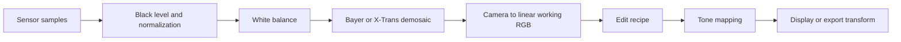

# Product direction and roadmap

Crema is a cross-platform RAW photo browser and non-destructive editor. It works
with existing folders and keeps originals unchanged. The current code is a Phase 0
feasibility application. [The architecture](../architecture.md) describes what is
implemented, and [the Phase 0 status](phase0-status.md) records what still needs
evidence.

## Product contract

- Opening a folder shows recognized files before the full scan completes.
- Originals remain read-only. Saved edits live beside them in XMP sidecars.
- A future local catalog accelerates browsing and filtering but is rebuildable
  from files and sidecars.
- Browsing, culling, and editing share one selection and navigation model.
- The interface reports an edit as saved only after the sidecar is durable.
- Unsupported files, disconnected drives, read-only folders, and conflicts have
  explicit states.
- Keyboard access, assistive technology, color correctness, and performance are
  release requirements.

## Format priorities

Fujifilm RAF and OM System or Olympus ORF are the first camera-specific targets.
The product must also support a broad RAW matrix, HEIC, and JPEG.

| Format | Required coverage |
| --- | --- |
| Fujifilm RAF | Bayer and X-Trans layouts, supported compression modes, fine detail, false color, white balance, and camera calibration. |
| OM System and Olympus ORF | Ordinary captures, high-resolution modes, active image area, orientation, white balance, highlights, and camera calibration. |
| Broad RAW | Representative Canon CR2 and CR3, Nikon NEF, Sony ARW, Panasonic RW2, Pentax PEF, and DNG files. Decoding and developed image quality remain separate results. |
| HEIC | Real phone and camera files, 8-bit and high-bit precision, grids, orientation, EXIF, ICC and CICP color, and defined HDR-to-SDR behavior. HEIC export is not an MVP requirement. |
| JPEG | Baseline and progressive files, EXIF orientation, embedded profiles, metadata, editing, and export. RAW and JPEG companions retain separate recipes. |

PNG and TIFF are useful input and export formats after the required paths work.
A recognized extension never proves that every camera, compression mode, or file
variant works.

## Persistence direction

XMP sidecars remain authoritative for saved edits and shared metadata. Crema uses
standard XMP properties for ratings and keywords when those features arrive. Its
own namespace stores picks and versioned edit recipes. A later interchange layer
must preserve foreign namespaces and explicit clears without weakening the current
refusal to overwrite packets that Crema cannot safely understand.

The planned catalog uses SQLite through `rusqlite`. SQLite is not present in the
current runtime. The catalog will live in local application storage, keep
thumbnail bytes outside the database, and rebuild from originals and sidecars.
It must not become the only copy of saved metadata or edits.

Sidecar publication and catalog updates are separate transactions. The sidecar
commits first, then the catalog refreshes. Startup reconciliation handles a crash
between those operations. File moves and deletes need a recoverable journal
because a group of filesystem operations is not atomic.

## Image pipeline direction

The Phase 0 editor adjusts display-ready 8-bit pixels. The editing MVP requires a
defined scene-linear pipeline with stable stage ordering.

Preview and export use the same recipe and color transforms. Recipe versions cover
algorithm defaults as well as control values. A renderer upgrade either migrates
the recipe or retains the older render path. RAW decode support alone does not
establish demosaic quality, camera calibration, or correct color.

## Milestones

| Phase | Deliverable | Gate before expanding |
| --- | --- | --- |
| 0. Feasibility | Grid and viewer with JPEG, RAW, and HEIC paths, exposure, XMP save and reopen, and profiled JPEG export. | Close the camera, HEIC, display color, assistive technology, native platform, license, performance, and memory rows in the Phase 0 status. |
| 1. Useful browser | Folder registration, background reconciliation, SQLite catalog, filmstrip, EXIF, sort and filter, and RAW plus JPEG grouping. | Browse 10,000 files responsively. Handle renames, missing files, and read-only folders without losing selection or state. |
| 2. Durable organization | Ratings, picks and rejects, keywords, batch edits, and XMP synchronization. | Rebuild the catalog from disk. Preserve foreign XMP. Survive interrupted writes and external changes without silent data loss. |
| 3. Editing MVP | White balance, tone controls, saturation, crop, straighten, sharpening, undo and redo, presets, JPEG export, and 16-bit TIFF export. | Golden-image and CPU versus GPU comparisons pass. Restart preserves recipes. Full preview and export agree within declared tolerances. |
| 4. Release hardening | Installable builds, recovery, an export queue, accessibility, and the published RAW, HEIC, and JPEG matrix. | Real-machine platform, GPU, display, permission, large-library, license-package, and fresh-install checks pass. |

## Performance targets

These targets require release builds, declared hardware, real fixtures, p50 and
p95 values, and raw measurements.

| Measurement | Initial target |
| --- | --- |
| Cached grid with 10,000 photos | 60 frames per second, with UI work and monitor presentation measured separately. |
| Cached next-photo preview | p95 below 100 ms, excluding the first open. |
| Exposure on a prepared 2 MP preview | p95 input-to-visible-result below 50 ms. |
| Memory while browsing 100,000 photos | Explicit CPU, GPU, cache, parent, and worker budgets with bounded growth. |
| Idle behavior | No continuous repaint and no repeated full-folder scan after work settles. |

## Deferred scope

Comparison tools, saved searches, safe rename and move operations, lens correction,
denoising, local masks, and panorama or HDR merge follow the editing MVP. Cloud
sync, face recognition, maps, video, plugins, mobile apps, and AI editing are not
part of the current roadmap.

The project uses Rust for application and image-processing code. SQLite is an
approved C dependency. Crema's original code remains MIT licensed. Every pinned
dependency keeps its own license and needs a distribution review before release.
